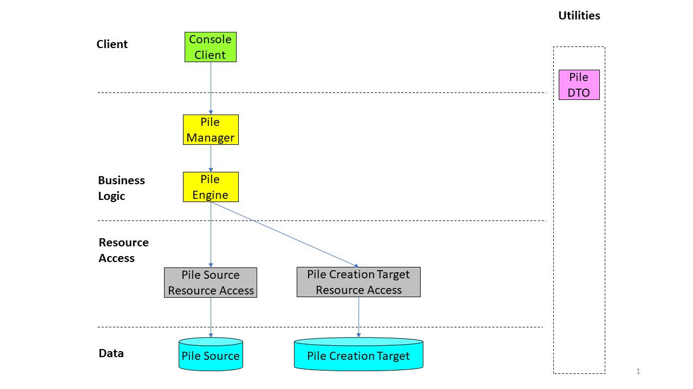

# PicturePile Creator
.net core application for creating insert scripts for creating piles for PicturePile.

## How to use
The tool is a .net core application developed and used on Windows 10. Currently only a Console client is implemented. There is no apparent reason for the tool not to work on Linux or macOS computers, but this was not tried yet.


### Using the tool through the console

Run the tool in 2 steps:
- Create the Pile definition entry (game.branch)
- Insert mediaitem, tile, branch_tile and expert_markup_ingame entries

#### 1) Pile definition:
Example for parameters to create pile definition:
> -s "E:\Temp\national_picturepile\0_1000n3000n5000" -t "E:\Temp\national_picturepile\output\1" -d 
- s: source directory
- t: target directory
- d: write pile definition
This will create the insert statement as an sql file in the target directory. Executing this sql will return the pile id to be used with the tile insertion.

#### 2) Inserting tiles
Example parameters:
> -s "E:\Temp\national_picturepile\0_1000n3000n5000" -t "E:\Temp\national_picturepile\output\1" -w -m 32 -p 91 -a
- s: source directory
- t: target directory
- d: write pile definition
- w: write tile inserts
- m: marker - mediaitem group 
- p: pileId (from step 1)
- a: including this will add the pileId as prefix to the image filename and copy the images to the output directory (way faster if this switch is not used)

#### Source directory structure
The source directory needs to have the following structure:
Both csv files, the json files and the three folders are currently required.
```
./
	example/
		filename.jpg
		filename_scrsh.jpg
		filename_marked.jpg
		filename_marked_scrsh.jpg
		...
	expert/
		filename.jpg
		filename_scrsh.jpg
		...
	ordinary/
		filename.jpg
		filename_scrsh.jpg
		...
	example_answer.csv
	expert_answer.csv
	picpile_title_91.jpg
	pileInfo.json
```
#### File structure
##### example_answer.csv (Column AnswerEng is currently not used)
```
Pilename,Filename,AnswerEng,AnswerIndo
0_1000n3000n5000,ex_1000n3000n5000_1.jpg,Yes,Ya
0_1000n3000n5001,ex_1000n3000n5000_2.jpg,Yes,Ya
```

##### expert_answer.csv (Column AnswerEng is currently not used)
```
Pilename,Filename,AnswerEng,AnswerIndo
0_1000n3000n5000,_538_0_20100613_042121_12574190.jpg,Yes,Ya
0_1000n3000n5000,_538_0_20100613_042121_13247577.jpg,Yes,Ya
```
##### pileInfo.json
```
{
	"campaign_name": "Klasifikasi tutupan lahan hutan alam primer",
	"location": "Kelompok pulau Sumatra",
	"question": "Apakah kamu melihat <color=#ff0000>hutan alam primer</color> di lebih dari separuh gambar?",
	"instruction_pages": [
		"Perhatikan gambar yang diambil dari citra satelit! Gambar yang muncul bisa saja berwarna atau hitam/putih. Bantu kami menjawab keberadaan hutan alam primer di gambar tersebut.",
		"Tekan tombol '-' untuk melihat area di sekeliling gambar dan tekan tombol '+' untuk kembali ke gambar yang ditanyakan.",
		"Jawab *Ya* dengan menggeser gambar ke kanan jika hutan alam primer terlihat di lebih dari separuh gambar.",
		"Jawab *Tidak* dengan menggeser gambar ke kiri jika hutan alam primer tidak terlihat di lebih dari separuh gambar.",
		"Jawab *Tidak Yakin* dengan menggeser gambar ke bawah jika kamu tidak dapat memastikan apakah hutan alam primer terlihat di lebih dari separuh gambar."
	],
	"answers": [
		"Ya",
		"Tidak",
		"Tidak Yakin"
	]
}
```

#### Deployment
1) Create a .zip containing the 3 image folders (ordinary, expert, example)
2) Create a single sql file for the inserts: `copy /b insert_example_tiles.sql+insert_expert_tiles.sql+insert_validation_tiles.sql insert1.sql`
3) Make sure the pile-logo has the correct filename.
4) Copy the images.zip, insert.sql and logo to the Geo-Wiki server (scp/winscp)
5) Start a new screen: `screen`
6) Copy logo: `cp picpile_title_91.jpg /var/www/geowiki/assets/game/logos/`
7) Unzip images (without folders): `sudo unzip -j images1.zip -d /var/www/geowiki/assets/game/urundata`
8) Run insert script: `/usr/lib/postgresql/9.6/bin/psql -U postgres -q -h localhost -d geowiki -f ./insert1.sql`
9) Disconnect from the screen 

## Development info
The structure of the app is based on the IDesign Method



PileManager, Engine and ResourceAccess are implemented using the factory pattern to keep things interchangable if this ever becomes a webservice. For this I'd propose adding an API client and different resource access.